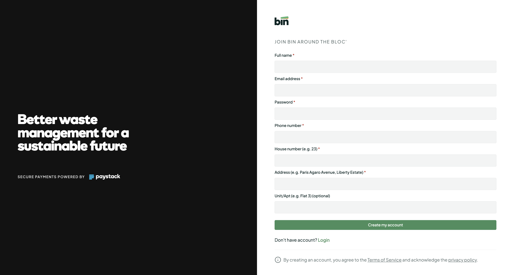

# Bin Around The Bloc'



A multi-tenant estate payment and reconciliation platform for residential waste management.

---

## Features

- **Residents**: Register using an estate code, view assigned waste bills, pay online with Paystack, and download verifiable receipts.
- **Estate Admins**: Live collection metrics, resident directory with opening balance tracking, street and property tier fee configuration, and offline payment reconciliation (Cash / Bank Transfer).

---

## Quick Start

### 1. Install Dependencies
```bash
npm install --legacy-peer-deps
```

### 2. Environment Setup
Create a `.env` file in the project root:

```env
VITE_SUPABASE_URL=your_supabase_url
VITE_SUPABASE_ANON_KEY=your_supabase_anon_key
SUPABASE_SERVICE_ROLE_KEY=your_supabase_service_role_key

VITE_PAYSTACK_PUBLIC_KEY=your_paystack_public_key
PAYSTACK_SECRET_KEY=your_paystack_secret_key
```

### 3. Run Development Server
```bash
npm run dev
```

### 4. Build for Production
```bash
npm run build
```

